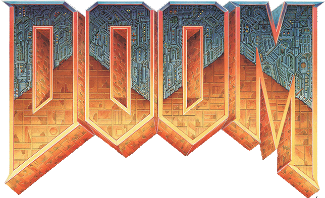
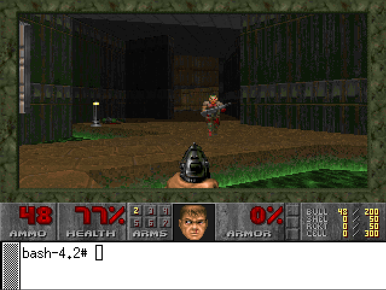

# SOS-DOOM-PROJECT

<p align="center">
  
</p>

This repository contains setup, purge, and additional scripts along a slightly modified and compiled version of [original DOOM game](https://github.com/id-Software/DOOM). Our modified source code is available in the [source repo](https://github.com/kubikulek231/SOS-DOOM-SOURCE).

The focus of our project is to compile and run the DOOM game on the CentOS Linux operating system (available to download from [here](https://www.centos.org/download/)) with as limited disk space as possible. With the approach specified in our scripts, we achieve around 92 megabytes of the total OS disk space while preserving the OS' core functions and the DOOM game's playability.

Done as part of an assignment during the BPC-SOS course at FEEC BUT.

<p align="center">
  
</p>

> A screenshot taken while running the X window with the game on the shrunk OS. In the bottom part, the Xterm terminal emulator can be used even while the game is running, for example, to exit the whole graphic environment.

### The Scripts ###

```bash
run-setup.sh
```

When placed in /root/, the script downloads this repository and runs the newer version of the script (e.g. updates itself). It then sets up the DOOM game, its dependencies, and other scripts from this repository. If the -a or --autopurge parameter is specified, it runs the run-purge.sh script when finished.

```bash
run-purge.sh
```

Purges, i.e., removes everything redundant for running the OS and the game and reboots it (in case -n or --noreboot is NOT specified). It can be run automatically by run-setup.sh or executed separately. Also accepts -s or --safemode as a parameter, which will run the script in safe mode.

```bash
run-doom.sh
```

Essentially a wrapper for the xinit command.

```bash
.xinitrc
```

A script that modifies the xinit command behavior: runs the Xterm terminal emulator with a custom size on the X server start and executes .run-doom script right after it.

```bash
get-current-os-size.sh
```

For debugging purposes, it retrieves the current size of the whole OS, excluding some directories. It retrieves the size in MiB and sorts the files by size.

```bash
get-yum-packages.sh
```

For debugging purposes, it lists every yum package installed by size and saves the output to packages.txt.

